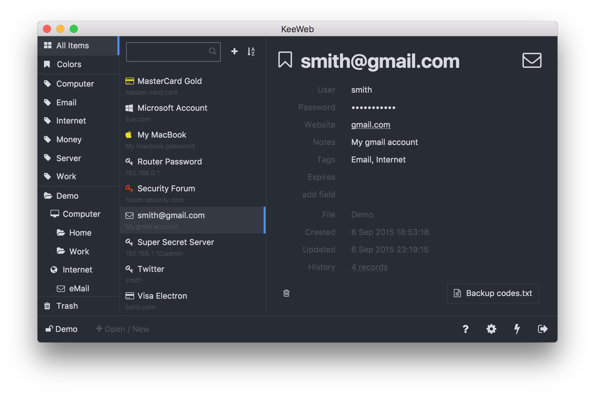

<div align="center">
<h1>KeeWeb Password Manager🔑</h1>
<br />
<p>KeeWeb is a browser and desktop password manager which is capable of opening up existing KeePass database `kdbx` files, or creating new vaults to store your important credentials in. </p>



<br />

<!-- prettier-ignore-start -->
[![Test Status][badge-tests]][link-tests]
[![Code Coverage][badge-coverage]][link-coverage]
[![Last Commit][badge-commit]][badge-commit]
[![Size][badge-size]][badge-size]
[![All Contributors][all-contributors-badge]](#contributors-)
<!-- prettier-ignore-end -->

</div>

---

<br />

- [About](#about)
  - [Quick Links](#quick-links)
- [Self-hosting](#self-hosting)
  - [Docker Users:](#docker-users)
- [Build From Source](#build-from-source)
  - [Platform: Windows](#platform-windows)
    - [Using Grunt](#using-grunt)
    - [Using NPM](#using-npm)
  - [Platform: Linux](#platform-linux)
    - [Using Grunt](#using-grunt-1)
    - [Using NPM](#using-npm-1)
  - [Platform: MacOS](#platform-macos)
    - [Using Grunt](#using-grunt-2)
    - [Using NPM](#using-npm-2)
- [Donations](#donations)
- [Contributors ✨](#contributors-)

<br />

---

<br />

## About

**KeeWeb** is a password manager which supports managing `kdbx` files created by other applications such as KeePass, KeePassXC, etc. You choose the platform you wish to run; as KeeWeb supports being installed and ran as either a Desktop application, or in your web-browser. 

<br />

With support for Linux, Windows, and MacOS, we give you the tools to seamlessly manage your most important credentials across multiple applications and platforms.

<br />

Decide how you want to save your credential vault, KeeWeb supports saving your database as a local file, or you can store your password vault with some of the most popular cloud services such as Dropbox, Google Drive, and Microsoft OneDrive. 

<br />

### Quick Links
Review some of our most important links below to learn more about KeeWeb and who we are:

<br />

Apps: [Web](https://app.keeweb.info/), [Desktop](https://github.com/keeweb/keeweb/releases/latest)  
Timeline: [Release Notes](release-notes.md), [TODO](https://github.com/keeweb/keeweb/wiki/TODO)  
On one page: [Features](https://keeweb.info/#features), [FAQ](https://github.com/keeweb/keeweb/wiki/FAQ)  
Website: [keeweb.info](https://keeweb.info)  
Twitter: [kee_web](https://twitter.com/kee_web)  
Donate: [OpenCollective](https://opencollective.com/keeweb#support), [GitHub](https://github.com/sponsors/antelle)  

<br />

---

<br />

## Self-hosting

Want to self-host your copy of KeeWeb? Everything you need to host this app on your server is provided within the package. KeeWeb itself is a single HTML file combined with a service worker (optionally; for offline access).

<br />

You can download the latest distribution files from [gh-pages](https://github.com/keeweb/keeweb/archive/gh-pages.zip) branch.  

<br />

### Docker Users:

1. Place your `dh.pem`, `cert.pem`, `key.pem` to `/etc/nginx/external/` 
2. Then execute the command below:

<br />

```bash
docker run --name keeweb -d -p 443:443 -p 80:80 -v $EXT_DIR:/etc/nginx/external/ antelle/keeweb
```

<br />

To configure Dropbox support on your self-hosted setup [view our Wiki page](https://github.com/keeweb/keeweb/wiki/Dropbox-and-GDrive).

<br />

---

<br />

## Build From Source

The easiest way to clone all KeeWeb repos is:
```bash
curl https://raw.githubusercontent.com/keeweb/keeweb/develop/dev-env.sh | bash -
```

<br />

KeeWeb can be built utilizing the **grunt commandline**. Each platform has multiple commands you can use; pick one:

<br />

### Platform: Windows
You may build KeeWeb for `Windows` by executing ONE of the following two commands provided:

#### Using Grunt
```shell
grunt dev-desktop-win32 --skip-sign
```

#### Using NPM
```shell
npm run dev-desktop-windows
```

<br />

### Platform: Linux
You may build KeeWeb for `Linux` by executing ONE of the following two commands provided:

#### Using Grunt
```shell
grunt dev-desktop-linux --skip-sign
```

#### Using NPM
```shell
npm run dev-desktop-linux
```

<br />

### Platform: MacOS
You may build KeeWeb for `MacOS` by executing ONE of the following two commands provided:

#### Using Grunt
```shell
grunt dev-desktop-darwin --skip-sign
```

#### Using NPM
```shell
npm run dev-desktop-macos
```

<br />

Once the build is complete, all (html files will be in `dist/` folder. To build KeeWeb, utilize the following commands below. 

<br />

To run the desktop (electron) app without building an installer, build the app with `grunt` and then launch KeeWeb with one of the following commands:

<br />

```bash
npm run dev
npm run electron
```

<br />

To debug your build:

1. run `npm run dev`
2. open `http://localhost:8085`

Once built, the output files will be generated in `tmp`:

<br />

---

<br />

## Donations

KeeWeb is not free to develop. It takes time, requires paid code signing certificates and domains.  
You can help the project or say "thank you" with this button:  
[](https://opencollective.com/keeweb#support)

<br />

You can also sponsor the developer directly [on GitHub](https://github.com/sponsors/antelle).  

<br />

Please note: donation does not imply any type of service contract.  

<br />

---

<br />

## Contributors ✨
We are always looking for contributors. If you feel that you can provide something useful to KeeWeb, then we'd love to review your suggestion. Before submitting your contribution, please review the following resources:

- [Pull Request Procedure](.github/PULL_REQUEST_TEMPLATE.md)
- [Contributor Policy](CONTRIBUTING.md)

<br />

Want to help but can't write code?
- Review [active questions by our community](https://github.com/keeweb/keeweb/labels/help%20wanted) and answer the ones you know.
- Help [translating KeeWeb](https://keeweb.oneskyapp.com)

<br />

The following people have helped get this project going:

<!-- ALL-CONTRIBUTORS-BADGE:START - Do not remove or modify this section -->
[](#contributors-)
<!-- ALL-CONTRIBUTORS-BADGE:END -->

<!-- ALL-CONTRIBUTORS-LIST:START - Do not remove or modify this section -->
<!-- prettier-ignore-start -->
<!-- markdownlint-disable -->
<table>
  <tbody>
    <tr>
      <td align="center" valign="top" width="14.28%"><a href="https://gitlab.com/antelle"><br /><sub><b>Antelle</b></sub></a><br /><a href="https://github.com/KeeWeb/KeeWeb/commits?author=antelle" title="Code">💻</a> <a href="#projectManagement-antelle" title="Project Management">📆</a> <a href="#fundingFinding-antelle" title="Funding Finding">🔍</a></td>
      <td align="center" valign="top" width="14.28%"><a href="https://gitlab.com/Aetherinox"><br /><sub><b>Aetherinox</b></sub></a><br /><a href="https://github.com/KeeWeb/KeeWeb/commits?author=Aetherinox" title="Code">💻</a> <a href="#projectManagement-Aetherinox" title="Project Management">📆</a> <a href="#fundingFinding-Aetherinox" title="Funding Finding">🔍</a></td>
      <td align="center" valign="top" width="14.28%"><a href="https://gitlab.com/HarlemSquirrel"><br /><sub><b>HarlemSquirrel</b></sub></a><br /><a href="https://github.com/KeeWeb/KeeWeb/commits?author=HarlemSquirrel" title="Code">💻</a> <a href="#projectManagement-HarlemSquirrel" title="Project Management">📆</a></td>
    </tr>
  </tbody>
</table>

<!-- markdownlint-restore -->
<!-- prettier-ignore-end -->

<!-- ALL-CONTRIBUTORS-LIST:END -->
<!-- ALL-CONTRIBUTORS-LIST:START - Do not remove or modify this section -->
<!-- prettier-ignore-start -->
<!-- markdownlint-disable -->
<!-- markdownlint-restore -->
<!-- prettier-ignore-end -->
<!-- ALL-CONTRIBUTORS-LIST:END -->

<!-- ALL-CONTRIBUTORS-LIST:START - Do not remove or modify this section -->
<!-- prettier-ignore-start -->
<!-- markdownlint-disable -->
<!-- markdownlint-restore -->
<!-- prettier-ignore-end -->

<!-- ALL-CONTRIBUTORS-LIST:END -->

<br />

---

<br />

<!-- prettier-ignore-start -->
[link-npm]: https://npmjs.com
[link-node]: https://nodejs.org
[link-npmtrends]: http://npmtrends.com/keeweb
[link-license]: https://github.com/Aetherinox/keeweb/blob/master/LICENSE
[link-package]: https://npmjs.com/package/Aetherinox/keeweb
[link-coverage]: https://codecov.io/github/Aetherinox/keeweb
[link-build]: https://github.com/Aetherinox/keeweb/actions/workflows/build.yaml?query=workflow%3Abuild.yml
[link-tests]: https://github.com/Aetherinox/keeweb/actions/workflows/tests.yaml?query=workflow%3Atests.yml

[badge-commit]: https://img.shields.io/github/last-commit/Aetherinox/keeweb?color=b43bcc
[badge-size]: https://img.shields.io/github/repo-size/Aetherinox/keeweb?label=size&color=59702a
[badge-build]: https://img.shields.io/github/actions/workflow/status/Aetherinox/keeweb/build.yml?logo=github&label=Build&color=%23278b30
[badge-tests]: https://img.shields.io/github/actions/workflow/status/Aetherinox/keeweb/tests.yml?logo=github&label=Tests&color=%23278b30
[badge-coverage]: https://img.shields.io/codecov/c/github/Aetherinox/keeweb?token=MPAVASGIOG&logo=codecov&logoColor=FFFFFF&label=Coverage&color=354b9e
[badge-version]: https://img.shields.io/npm/v/keeweb/keeweb
[badge-downloads]: https://img.shields.io/npm/dm/keeweb.svg
[badge-license]: https://img.shields.io/npm/l/keeweb.svg
[all-contributors]: https://github.com/all-contributors/all-contributors
[all-contributors-badge]: https://img.shields.io/github/all-contributors/Aetherinox/keeweb?color=de1f6f&label=contributors
<!-- prettier-ignore-end -->
