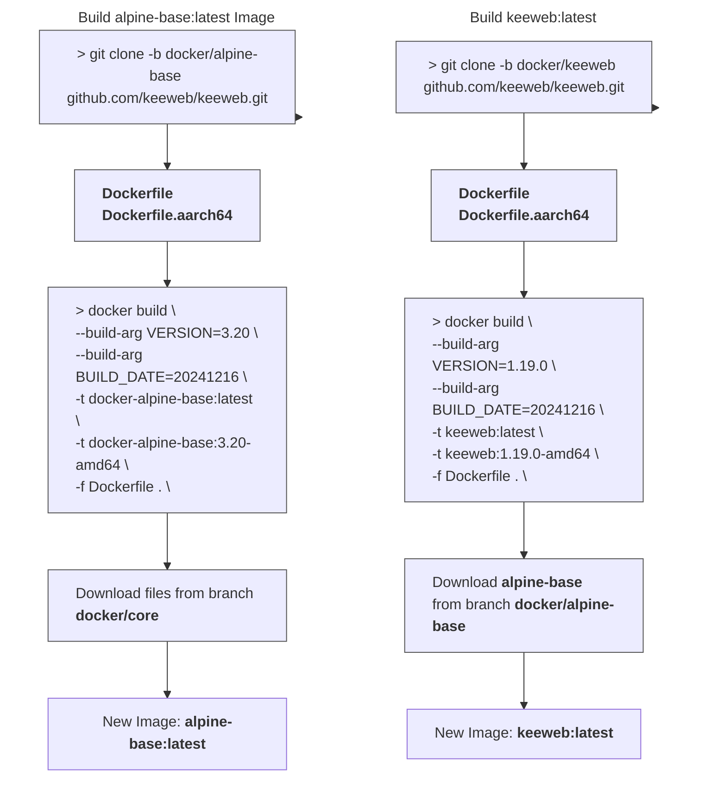

<div align="center">
<h6>Scripts utilized with our Alpine Base docker image</h6>
<h1>📄 Alpine - Core Scripts 📄</h1>

<br />

This branch `docker/core` contains a set of scripts which are utilized when building the [Keeweb Alpine Core Image](https://github.com/keeweb/keeweb/tree/docker/alpine-base).

</p>

<br />


<br />
<br />

</div>

<br />

---

<br />

- [About](#about)
- [Before Building](#before-building)
  - [LF over CRLF](#lf-over-crlf)
  - [Set +x Executable](#set-x-executable)
- [Build Base Image](#build-base-image)
- [Usage with Keeweb Docker Image](#usage-with-keeweb-docker-image)


<br />

---

<br />

## About
The scripts contained within this branch `docker/core` are called upon from the [Keeweb Base Alpine](https://github.com/keeweb/keeweb/tree/docker/alpine-base) image.  The Base Alpine image does **NOT** contain Keeweb, it only contains the base Alpine operating system, a minimal amount of packages, and Nginx. It is used as the foundation for which the Keeweb docker image will be built from.

<br />

This means that in order to build a docker image which contains Keeweb, you need two different docker images:
- Step 1: Build **[docker/alpine-base](https://github.com/keeweb/keeweb/tree/docker/alpine-base)** image
  - When being build, the alpine-base Dockerfile will grab and install the files from this branch `docker/core`
- Step 2: Build **[docker/keeweb](https://github.com/keeweb/keeweb/tree/docker/keeweb)** image
- Step 3: Release the docker image built from **Step 2** to Github's **Ghcr.io** or **hub.docker.com**

<br />

> [!WARNING]
> You should NOT need to modify any of the files within this branch `docker/core` unless you absolutely know what you are doing.

<br />

This branch contains builds for the following architectures:

| Architecture | Dockerfile |
| --- | --- |
| **amd64** | `Dockerfile` |
| **arm64** | `Dockerfile.aarch64` |

<br />

The files in this branch are referered in the following files:

- [docker/alpine-base/Dockerfile](https://github.com/keeweb/keeweb/blob/docker/alpine-base/Dockerfile)
- [docker/alpine-base/Dockerfile.aarch64](https://github.com/keeweb/keeweb/blob/docker/alpine-base/Dockerfile.aarch64)

<br />

When you build the base alpine image, the following files will be automatically included:

```bash
ADD --chmod=755 "https://raw.githubusercontent.com/keeweb/keeweb/docker/core/docker-images.${MODS_VERSION}" "/docker-images"
ADD --chmod=755 "https://raw.githubusercontent.com/keeweb/keeweb/docker/core/package-install.${PKG_INST_VERSION}" "/etc/s6-overlay/s6-rc.d/init-mods-package-install/run"
ADD --chmod=755 "https://raw.githubusercontent.com/keeweb/keeweb/docker/core/kwown.${KWOWN_VERSION}" "/usr/bin/kwown"
```

<br />

`kwown` is vital and must be included in the base image you build. It is what controls the **USER:GROUP** permissions that will be handled within your docker image. For this reason, there are a few requirements you can read about below in the section [Before Building](#before-building)

<br />

---

<br >

## Before Building

Prior to building the docker image, you must ensure that the following conditions are met. If the below tasks are not performed, your docker container will throw the following errors when started:

- `/etc/s6-overlay/s6-rc.d/init-adduser/run: /usr/bin/kwown: cannot execute: required file not found`

<br />

### LF over CRLF

You cannot utilize Windows' `Carriage Return Line Feed`. All files must be converted over to Unix' `Line Feed`.  This can be done in applications such as Visual Studio Code. Or you can run Linux terminal commands to convert these files:

```shell
dos2unix docker-images.v3
dos2unix kwown.v1
dos2unix package-install.v1
dos2unix with-contenv.v1
```

<br />

### Set +x Executable
The files contained within this repo **MUST** have `chmod 755`, also known as `+x` executable permissions. This is done automatically by the [Keeweb Base Alpine](https://github.com/keeweb/keeweb/tree/docker/alpine-base) `Dockerfile`, however, if you need to do this manually for some reason; ensure those files have the correct permissions prior to building the base Alpine docker image.

<br />

---

<br />

## Build Base Image

The scripts contained within this `docker/core` branch do not need anything else special to them. In order to use these scripts, simply clone the [Keeweb Base Alpine](https://github.com/keeweb/keeweb/tree/docker/alpine-base) `Dockerfile` repo:

```shell
git clone -b docker/alpine-base https://github.com/keeweb/keeweb.git .
```

<br />

Once the repo is cloned, the calls to include the scripts in this `docker/core` branch are within the `Dockerfile` and `Dockerfile.aarch64`. So simply build your base alpine image:

```shell ignore
docker build --build-arg VERSION=3.20 --build-arg BUILD_DATE=20241216 -t alpine-base:latest -t alpine-base:3.20-amd64 -f Dockerfile .

docker build --build-arg VERSION=3.20 --build-arg BUILD_DATE=20241216 -t alpine-base:3.20-arm64 -f Dockerfile.aarch64 .
```



<br />

Once the base alpine image is built, you can now build the actual docker version of Keeweb. The files for this docker image are stored in the branch `docker/keeweb`:

- https://github.com/keeweb/keeweb/tree/docker/keeweb

<br />

---

<br />

## Usage with Keeweb Docker Image

After the base alpine image is built, you can now use this docker image as a base for the official Keeweb docker image. Navigate to the branch `docker/keeweb` and open:

- `Dockerfile`
- `Dockerfile.aarch64`

<br />

Next, specify this base image from this branch which will be used as the foundation of the Keeweb docker image:

```dockerfile
FROM ghcr.io/keeweb/alpine-base:3.20-amd64
```

After you have completed configuring the Keeweb dockerfile, you can now build the official version of Keeweb. Ensure you build an image for both `amd64` and `aarch64`.

<br />

For the argument `VERSION`; specify the current release of Keeweb which will be contained within the docker image. It should be in the format of `YYYYMMDD`:

```shell
docker build --build-arg VERSION=1.19.0 --build-arg BUILD_DATE=20241216 -t keeweb:latest -t keeweb:1.19.0 -t keeweb:1.19.0-amd64 -f Dockerfile .

docker build --build-arg VERSION=1.19.0 --build-arg BUILD_DATE=20241216 -t keeweb:1.19.0-arm64 -f Dockerfile.aarch64 .
```

<br />

When building your images With the commands provided above, ensure you create two sets of tags:

| Architecture | Dockerfile | Tags |
| --- | --- | --- |
| `amd64` | `Dockerfile` | `keeweb:latest` <br /> `keeweb:1.19.0` <br /> `keeweb:1.19.0-amd64` |
| `arm64` | `Dockerfile` | `keeweb:1.19.0-arm64` |

<br />

---

<br />

<!-- BADGE > GENERAL -->
  [general-npmjs-uri]: https://npmjs.com
  [general-nodejs-uri]: https://nodejs.org
  [general-npmtrends-uri]: http://npmtrends.com/keeweb

<!-- BADGE > VERSION > GITHUB -->
  [github-version-img]: https://img.shields.io/github/v/tag/keeweb/keeweb?logo=GitHub&label=Version&color=ba5225
  [github-version-uri]: https://github.com/keeweb/keeweb/releases

<!-- BADGE > VERSION > GITHUB (For the Badge) -->
  [github-version-ftb-img]: https://img.shields.io/github/v/tag/keeweb/keeweb?style=for-the-badge&logo=github&logoColor=FFFFFF&logoSize=34&label=%20&color=ba5225
  [github-version-ftb-uri]: https://github.com/keeweb/keeweb/releases

<!-- BADGE > VERSION > NPMJS -->
  [npm-version-img]: https://img.shields.io/npm/v/keeweb?logo=npm&label=Version&color=ba5225
  [npm-version-uri]: https://npmjs.com/package/keeweb

<!-- BADGE > VERSION > PYPI -->
  [pypi-version-img]: https://img.shields.io/pypi/v/keeweb
  [pypi-version-uri]: https://pypi.org/project/keeweb/

<!-- BADGE > LICENSE > MIT -->
  [license-mit-img]: https://img.shields.io/badge/MIT-FFF?logo=creativecommons&logoColor=FFFFFF&label=License&color=9d29a0
  [license-mit-uri]: https://github.com/keeweb/keeweb/blob/main/LICENSE

<!-- BADGE > GITHUB > DOWNLOAD COUNT -->
  [github-downloads-img]: https://img.shields.io/github/downloads/keeweb/keeweb/total?logo=github&logoColor=FFFFFF&label=Downloads&color=376892
  [github-downloads-uri]: https://github.com/keeweb/keeweb/releases

<!-- BADGE > NPMJS > DOWNLOAD COUNT -->
  [npmjs-downloads-img]: https://img.shields.io/npm/dw/%40keeweb%2Fkeeweb?logo=npm&&label=Downloads&color=376892
  [npmjs-downloads-uri]: https://npmjs.com/package/keeweb

<!-- BADGE > GITHUB > DOWNLOAD SIZE -->
  [github-size-img]: https://img.shields.io/github/repo-size/keeweb/keeweb?logo=github&label=Size&color=59702a
  [github-size-uri]: https://github.com/keeweb/keeweb/releases

<!-- BADGE > NPMJS > DOWNLOAD SIZE -->
  [npmjs-size-img]: https://img.shields.io/npm/unpacked-size/keeweb/latest?logo=npm&label=Size&color=59702a
  [npmjs-size-uri]: https://npmjs.com/package/keeweb

<!-- BADGE > CODECOV > COVERAGE -->
  [codecov-coverage-img]: https://img.shields.io/codecov/c/github/keeweb/keeweb?token=MPAVASGIOG&logo=codecov&logoColor=FFFFFF&label=Coverage&color=354b9e
  [codecov-coverage-uri]: https://codecov.io/github/keeweb/keeweb

<!-- BADGE > ALL CONTRIBUTORS -->
  [contribs-all-img]: https://img.shields.io/github/all-contributors/keeweb/keeweb?logo=contributorcovenant&color=de1f6f&label=contributors
  [contribs-all-uri]: https://github.com/all-contributors/all-contributors

<!-- BADGE > GITHUB > BUILD > NPM -->
  [github-build-img]: https://img.shields.io/github/actions/workflow/status/keeweb/keeweb/deploy-docker.yml?logo=github&logoColor=FFFFFF&label=Build&color=%23278b30
  [github-build-uri]: https://github.com/keeweb/keeweb/actions/workflows/deploy-docker.yml

<!-- BADGE > GITHUB > BUILD > Pypi -->
  [github-build-pypi-img]: https://img.shields.io/github/actions/workflow/status/keeweb/keeweb/release-pypi.yml?logo=github&logoColor=FFFFFF&label=Build&color=%23278b30
  [github-build-pypi-uri]: https://github.com/keeweb/keeweb/actions/workflows/pypi-release.yml

<!-- BADGE > GITHUB > TESTS -->
  [github-tests-img]: https://img.shields.io/github/actions/workflow/status/keeweb/keeweb/npm-tests.yml?logo=github&label=Tests&color=2c6488
  [github-tests-uri]: https://github.com/keeweb/keeweb/actions/workflows/npm-tests.yml

<!-- BADGE > GITHUB > COMMIT -->
  [github-commit-img]: https://img.shields.io/github/last-commit/keeweb/keeweb?logo=conventionalcommits&logoColor=FFFFFF&label=Last%20Commit&color=313131
  [github-commit-uri]: https://github.com/keeweb/keeweb/commits/main/

<!-- BADGE > DOCKER HUB > VERSION -->
  [dockerhub-version-img]: https://img.shields.io/docker/v/antelle/keeweb/latest?logo=docker&logoColor=FFFFFF&label=Docker%20Version&color=ba5225
  [dockerhub-version-uri]: https://hub.docker.com/repository/docker/antelle/keeweb/general
