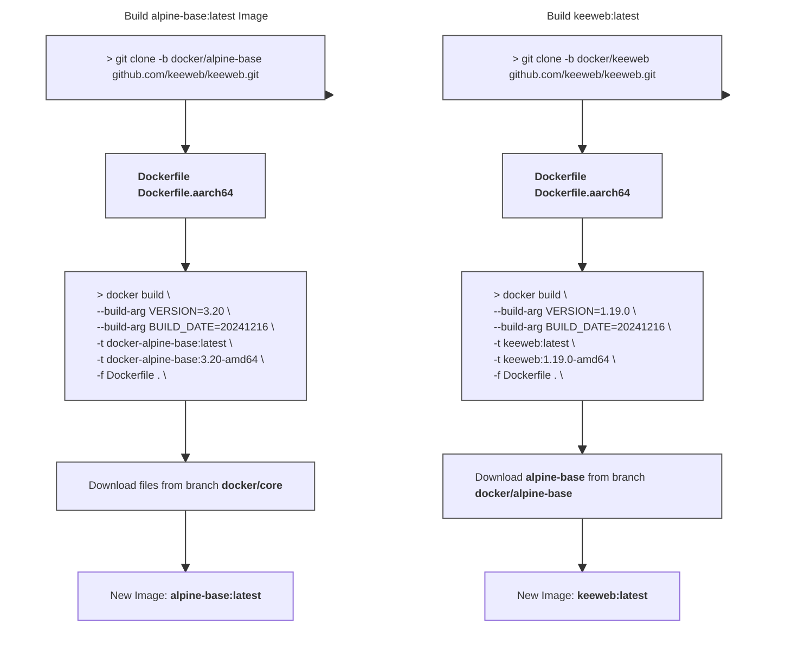

<div align="center">
<h6>Docker Image for building docker/keeweb</h6>
<h1>💿 Alpine - Base Image 💿</h1>

<br />

This branch `docker/base-alpine` contains the base docker alpine image which is utilized to create our docker images for the [Keeweb](https://keeweb.info/) password manager. This alpine image is only used to build the **[docker/keeweb](https://github.com/keeweb/keeweb/tree/docker/keeweb)** image.

 Normal users should not have a need to access this branch. It does **not** contain the production image for Keeweb.
 
</p>

<br />


<br />
<br />

</div>

<br />

---

<br />

- [About](#about)
- [Before Building](#before-building)
  - [LF over CRLF](#lf-over-crlf)
  - [Set +x / 0755 Permissions](#set-x--0755-permissions)
- [Build `docker/alpine-base` Image](#build-dockeralpine-base-image)
  - [amd64](#amd64)
  - [arm64 / aarch64](#arm64--aarch64)
- [Build `docker/keeweb` Image](#build-dockerkeeweb-image)
  - [amd64](#amd64-1)
  - [arm64 / aarch64](#arm64--aarch64-1)
  - [hub.docker.com / ghcr.io / local](#hubdockercom--ghcrio--local)
  - [Image Tags](#image-tags)
- [Using `docker/keeweb` Image](#using-dockerkeeweb-image)
  - [docker run](#docker-run)
  - [docker-compose.yml](#docker-composeyml)
- [Extra Notes](#extra-notes)
  - [Custom Scripts](#custom-scripts)


<br />

---

<br />

## About
The files contained within this branch `docker/alpine-base` are utilized as a foundation. This base image only provides us with a docker image which has alpine linux, Nginx, a few critical packages, and the **[s6-overlay](https://github.com/just-containers/s6-overlay)** plugin.

This branch `docker/alpine-base` does **NOT** contain Keeweb. Those files are available within the **[docker/keeweb](https://github.com/keeweb/keeweb/tree/docker/keeweb)** branch.

<br />

To build a docker image for Keeweb, you need two different docker images:
- Step 1: Build **[docker/alpine-base](https://github.com/keeweb/keeweb/tree/docker/alpine-base)** image **(this branch)**
  - When being build, the alpine-base `Dockerfile` will grab and install the files from the branch **[docker/core](https://github.com/keeweb/keeweb/tree/docker/core)**
- Step 2: Build **[docker/keeweb](https://github.com/keeweb/keeweb/tree/docker/keeweb)** image
- Step 3: Release the docker image built from **Step 2** to Github's **Ghcr.io** or **hub.docker.com**

<br />

> [!WARNING]
> You should NOT need to modify any of the files within this branch `docker/core` unless you absolutely know what you are doing.

<br />

When you build this **[docker/alpine-base](https://github.com/keeweb/keeweb/tree/docker/alpine-base)** image, the `Dockerfile` and `Dockerfile.aarch64` files will request files from another branch we host, which is the **[docker/core](https://github.com/keeweb/keeweb/tree/docker/core)** branch.

```bash
ADD --chmod=755 "https://raw.githubusercontent.com/keeweb/keeweb/docker/core/docker-images.${MODS_VERSION}" "/docker-images"
ADD --chmod=755 "https://raw.githubusercontent.com/keeweb/keeweb/docker/core/package-install.${PKG_INST_VERSION}" "/etc/s6-overlay/s6-rc.d/init-mods-package-install/run"
ADD --chmod=755 "https://raw.githubusercontent.com/keeweb/keeweb/docker/core/kwown.${KWOWN_VERSION}" "/usr/bin/kwown"
```

<br />

`kwown` is vital and must be included in the base image you build. It is what controls the **USER : GROUP** permissions that will be handled within your docker image. 

For this reason, there are a few requirements you can read about below in the section **[Before Building](#before-building)**.

<br />

---

<br >

## Before Building

Prior to building the ****[docker/alpine-base](https://github.com/keeweb/keeweb/tree/docker/alpine-base)**** and **[docker/keeweb](https://github.com/keeweb/keeweb/tree/docker/keeweb)** docker images, you **must** ensure the following conditions are met. If the below tasks are not performed, your docker container will throw the following errors when started:

- `Failed to open apk database: Permission denied`
- `s6-rc: warning: unable to start service init-adduser: command exited 127`
- `unable to exec /etc/s6-overlay/s6-rc.d/init-envfile/run: Permission denied`
- `/etc/s6-overlay/s6-rc.d/init-adduser/run: line 34: kwown: command not found`
- `/etc/s6-overlay/s6-rc.d/init-adduser/run: /usr/bin/kwown: cannot execute: required file not found`

<br />

### LF over CRLF

You cannot utilize Windows' `Carriage Return Line Feed`. All files must be converted to Unix' `Line Feed`.  This can be done with **[Visual Studio Code](https://code.visualstudio.com/)**. OR; you can run the Linux terminal command `dos2unix` to convert these files:

```shell
dos2unix docker-images.v3
dos2unix kwown.v1
dos2unix package-install.v1
dos2unix with-contenv.v1
```

<br />

### Set +x / 0755 Permissions
The files contained within this repo **MUST** have `chmod 755` /  `+x` executable permissions. If you are using the **[Keeweb Github Workflow](https://github.com/keeweb/keeweb/blob/master/.github/workflows/deploy-docker-github.yml)**, this is done automatically. If you are builting the images manually; you need to do this. Ensure those files have the correct permissions prior to building the Alpine base docker image.

If you are building the **[docker/alpine-base](https://github.com/keeweb/keeweb/tree/docker/alpine-base)** or **[docker/keeweb](https://github.com/keeweb/keeweb/tree/docker/keeweb)** images, you must ensure the files in those branches have the proper permissions. All of the executable files are named `run`:

```shell
find ./ -name 'run' -exec chmod +x {} \;
```

<br />

For the branch **[docker/core](https://github.com/keeweb/keeweb/tree/docker/core)**, there are a few files to change. The ending version number may change, but the commands to change the permissions are as follows:

```shell
sudo chmod 755 docker-images.v3
sudo chmod 755 kwown.v1
sudo chmod 755 package-install.v1
sudo chmod 755 with-contenv.v1
```

<br />

---

<br />

## Build `docker/alpine-base` Image

In order to use the files in this repo `docker/alpine-base`, clone the branch:

```shell
git clone -b docker/alpine-base https://github.com/keeweb/keeweb.git .
```

<br />

Once cloned, you can now make whatever adjustments you deem fit. Once your edits are done, you will need to build the base image:

### amd64

```shell ignore
# Build keeweb alpine-base amd64
docker build --build-arg VERSION=3.20 --build-arg BUILD_DATE=20241216 -t alpine-base:latest -t alpine-base:3.20-amd64 -f Dockerfile .
```

<br />

### arm64 / aarch64

```shell
# Build keeweb alpine-base arm64
docker build --build-arg VERSION=3.20 --build-arg BUILD_DATE=20241216 -t alpine-base:3.20-arm64 -f Dockerfile.aarch64 .
```

<br />

The flow of the process is outlined below:



<br />

Once the base alpine image is built, you can now build the actual docker version of Keeweb. The files for this docker image are stored in the branch `docker/keeweb`:

- https://github.com/keeweb/keeweb/tree/docker/keeweb

<br />

---

<br />

## Build `docker/keeweb` Image

After the **[docker/alpine-base](https://github.com/keeweb/keeweb/tree/docker/alpine-base)** image is built, you can now use that docker image as a base to build the **[docker/keeweb](https://github.com/keeweb/keeweb/tree/docker/keeweb)** image. Navigate to the branch `docker/keeweb` and open the files:

- `Dockerfile`
- `Dockerfile.aarch64`

<br />

Next, specify the **[docker/alpine-base](https://github.com/keeweb/keeweb/tree/docker/alpine-base)** image which will be used as the foundation of the **[docker/keeweb](https://github.com/keeweb/keeweb/tree/docker/keeweb)** image:

```dockerfile
FROM ghcr.io/keeweb/alpine-base:3.20-amd64
```

After you have completed configuring the **[docker/keeweb](https://github.com/keeweb/keeweb/tree/docker/keeweb)** `Dockerfile`, you can now build the official version of Keeweb. Remember to build an image for both `amd64` and `aarch64`.

<br />

For the argument `VERSION`; specify the current release of Keeweb which will be contained within the docker image. It should be in the format of `YYYYMMDD`:

<br />

### amd64

```shell
# Build docker/keeweb amd64
docker build --build-arg VERSION=1.19.0 --build-arg BUILD_DATE=20241216 -t keeweb:latest -t keeweb:1.19.0 -t keeweb:1.19.0-amd64 -f Dockerfile .
```

<br />

### arm64 / aarch64

```shell
# Build docker/keeweb arm64
docker build --build-arg VERSION=1.19.0 --build-arg BUILD_DATE=20241216 -t keeweb:1.19.0-arm64 -f Dockerfile.aarch64 .
```

<br />

### hub.docker.com / ghcr.io / local
After you have your **[docker/keeweb](https://github.com/keeweb/keeweb/tree/docker/keeweb)** image built, you can either upload the image to a public repository such as:

- hub.docker.com (Docker Hub)
- ghcr.io (Github)

After it is uploaded, you can use the `docker run` command, or create a `docker-compose.yml`, and call the docker image to be used. 

This is discussed in the section **[Using docker/keeweb Image](#using-dockerkeeweb-image)** below.

<br />

### Image Tags
When building your images with the commands provided above, ensure you create two sets of tags:

| Architecture | Dockerfile | Tags |
| --- | --- | --- |
| `amd64` | `Dockerfile` | `keeweb:latest` <br /> `keeweb:1.19.0` <br /> `keeweb:1.19.0-amd64` |
| `arm64` | `Dockerfile.aarch64` | `keeweb:1.19.0-arm64` |

<br />

the `amd64` arch gets a few extra tags because it should be the default image people clone. 

<br />

---

<br />

## Using `docker/keeweb` Image

To use the new **[docker/keeweb](https://github.com/keeweb/keeweb/tree/docker/keeweb)** image, you can either call it with the `docker run` command, or create a new `docker-compose.yml` and specify the image:

<br />

### docker run

If you want to use the keeweb docker image in the `docker run` command, execute the following:

```shell
docker run -d --restart=unless-stopped -p 443:443 --name keeweb -v ${PWD}/keeweb:/config ghcr.io/keeweb/keeweb:latest
```

<br />

### docker-compose.yml

If you'd much rather use a `docker-compose.yml` file and call the keeweb image that way, create a new folder somewhere:

```shell
mkdir -p /home/docker/keeweb
```

Then create a new `docker-compose.yml` file and add the following:

```shell
sudo nano /home/docker/keeweb/docker-compose.yml
```

```yml
services:
    keeweb:
        container_name: keeweb
        image: ghcr.io/keeweb/keeweb:latest          # Github image
      # image: keeweb/keeweb:latest                  # Dockerhub image
        restart: unless-stopped
        volumes:
            - ./keeweb:/config
        environment:
            - PUID=1000
            - PGID=1000
            - TZ=Etc/UTC
```

<br />

Once the `docker-compose.yml` is set up, you can now start your keeweb container:

```shell
cd /home/docker/keeweb/
docker compose up -d
```

<br />

Keeweb should now be running as a container. You can access it by opening your browser and going to:

```shell
http://container-ip
https://container-ip
```

<br />

---

<br />

## Extra Notes

The following are other things to take into consideration when creating the **[docker/alpine-base](https://github.com/keeweb/keeweb/tree/docker/alpine-base)** and **[docker/keeweb](https://github.com/keeweb/keeweb/tree/docker/keeweb)** images:

<br />

### Custom Scripts

The `docker/alpine-base` and `docker/keeweb` images support the ability of adding custom scripts that will be ran when the container is started. To create / add a new custom script to the container, you need to create a new folder in the container source files `/root` folder

```shell
mkdir -p /root/custom-cont-init.d/
```

<br />

Within this new folder, add your custom script:

```shell
nano /root/custom-cont-init.d/my_customs_script
```

<br />

```bash
#!/bin/bash

echo "**** INSTALLING BASH ****"
apk add --no-cache bash
```

<br />

When you create the docker image, this new script will automatically be loaded. You can also do this via the `docker-compose.yml` file by mounting a new volume:

```yml
services:
    keeweb:
        volumes:
            - ./keeweb:/config
            - ./custom-scripts:/custom-cont-init.d:ro
```

<br />

> [!NOTE]
> if using compose, we recommend mounting them **read-only** (`:ro`) so that container processes cannot write to the location.

> [!WARNING]
> The folder `/root/custom-cont-init.d` **MUST** be owned by `root`. If this is not the case, this folder will be renamed and a new empty folder will be created. This is to prevent remote code execution by putting scripts in the aforesaid folder.

<br />

The **[docker/keeweb](https://github.com/keeweb/keeweb/tree/docker/keeweb)** image already contains a custom script called `/root/custom-cont-init.d/plugins`. Do **NOT** edit this script. It is what automatically downloads the official Keeweb plugins and adds them to the container.

<br />

---

<br />

<!-- BADGE > GENERAL -->
  [general-npmjs-uri]: https://npmjs.com
  [general-nodejs-uri]: https://nodejs.org
  [general-npmtrends-uri]: http://npmtrends.com/keeweb

<!-- BADGE > VERSION > GITHUB -->
  [github-version-img]: https://img.shields.io/github/v/tag/keeweb/keeweb?logo=GitHub&label=Version&color=ba5225
  [github-version-uri]: https://github.com/keeweb/keeweb/releases

<!-- BADGE > VERSION > GITHUB (For the Badge) -->
  [github-version-ftb-img]: https://img.shields.io/github/v/tag/keeweb/keeweb?style=for-the-badge&logo=github&logoColor=FFFFFF&logoSize=34&label=%20&color=ba5225
  [github-version-ftb-uri]: https://github.com/keeweb/keeweb/releases

<!-- BADGE > VERSION > NPMJS -->
  [npm-version-img]: https://img.shields.io/npm/v/keeweb?logo=npm&label=Version&color=ba5225
  [npm-version-uri]: https://npmjs.com/package/keeweb

<!-- BADGE > VERSION > PYPI -->
  [pypi-version-img]: https://img.shields.io/pypi/v/keeweb
  [pypi-version-uri]: https://pypi.org/project/keeweb/

<!-- BADGE > LICENSE > MIT -->
  [license-mit-img]: https://img.shields.io/badge/MIT-FFF?logo=creativecommons&logoColor=FFFFFF&label=License&color=9d29a0
  [license-mit-uri]: https://github.com/keeweb/keeweb/blob/main/LICENSE

<!-- BADGE > GITHUB > DOWNLOAD COUNT -->
  [github-downloads-img]: https://img.shields.io/github/downloads/keeweb/keeweb/total?logo=github&logoColor=FFFFFF&label=Downloads&color=376892
  [github-downloads-uri]: https://github.com/keeweb/keeweb/releases

<!-- BADGE > NPMJS > DOWNLOAD COUNT -->
  [npmjs-downloads-img]: https://img.shields.io/npm/dw/%40keeweb%2Fkeeweb?logo=npm&&label=Downloads&color=376892
  [npmjs-downloads-uri]: https://npmjs.com/package/keeweb

<!-- BADGE > GITHUB > DOWNLOAD SIZE -->
  [github-size-img]: https://img.shields.io/github/repo-size/keeweb/keeweb?logo=github&label=Size&color=59702a
  [github-size-uri]: https://github.com/keeweb/keeweb/releases

<!-- BADGE > NPMJS > DOWNLOAD SIZE -->
  [npmjs-size-img]: https://img.shields.io/npm/unpacked-size/keeweb/latest?logo=npm&label=Size&color=59702a
  [npmjs-size-uri]: https://npmjs.com/package/keeweb

<!-- BADGE > CODECOV > COVERAGE -->
  [codecov-coverage-img]: https://img.shields.io/codecov/c/github/keeweb/keeweb?token=MPAVASGIOG&logo=codecov&logoColor=FFFFFF&label=Coverage&color=354b9e
  [codecov-coverage-uri]: https://codecov.io/github/keeweb/keeweb

<!-- BADGE > ALL CONTRIBUTORS -->
  [contribs-all-img]: https://img.shields.io/github/all-contributors/keeweb/keeweb?logo=contributorcovenant&color=de1f6f&label=contributors
  [contribs-all-uri]: https://github.com/all-contributors/all-contributors

<!-- BADGE > GITHUB > BUILD > NPM -->
  [github-build-img]: https://img.shields.io/github/actions/workflow/status/keeweb/keeweb/deploy-docker.yml?logo=github&logoColor=FFFFFF&label=Build&color=%23278b30
  [github-build-uri]: https://github.com/keeweb/keeweb/actions/workflows/deploy-docker.yml

<!-- BADGE > GITHUB > BUILD > Pypi -->
  [github-build-pypi-img]: https://img.shields.io/github/actions/workflow/status/keeweb/keeweb/release-pypi.yml?logo=github&logoColor=FFFFFF&label=Build&color=%23278b30
  [github-build-pypi-uri]: https://github.com/keeweb/keeweb/actions/workflows/pypi-release.yml

<!-- BADGE > GITHUB > TESTS -->
  [github-tests-img]: https://img.shields.io/github/actions/workflow/status/keeweb/keeweb/npm-tests.yml?logo=github&label=Tests&color=2c6488
  [github-tests-uri]: https://github.com/keeweb/keeweb/actions/workflows/npm-tests.yml

<!-- BADGE > GITHUB > COMMIT -->
  [github-commit-img]: https://img.shields.io/github/last-commit/keeweb/keeweb?logo=conventionalcommits&logoColor=FFFFFF&label=Last%20Commit&color=313131
  [github-commit-uri]: https://github.com/keeweb/keeweb/commits/main/

<!-- BADGE > DOCKER HUB > VERSION -->
  [dockerhub-version-img]: https://img.shields.io/docker/v/antelle/keeweb/latest?logo=docker&logoColor=FFFFFF&label=Docker%20Version&color=ba5225
  [dockerhub-version-uri]: https://hub.docker.com/repository/docker/antelle/keeweb/general
