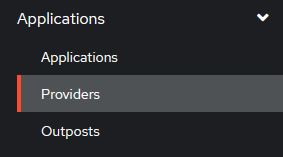
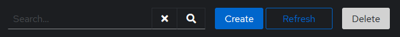
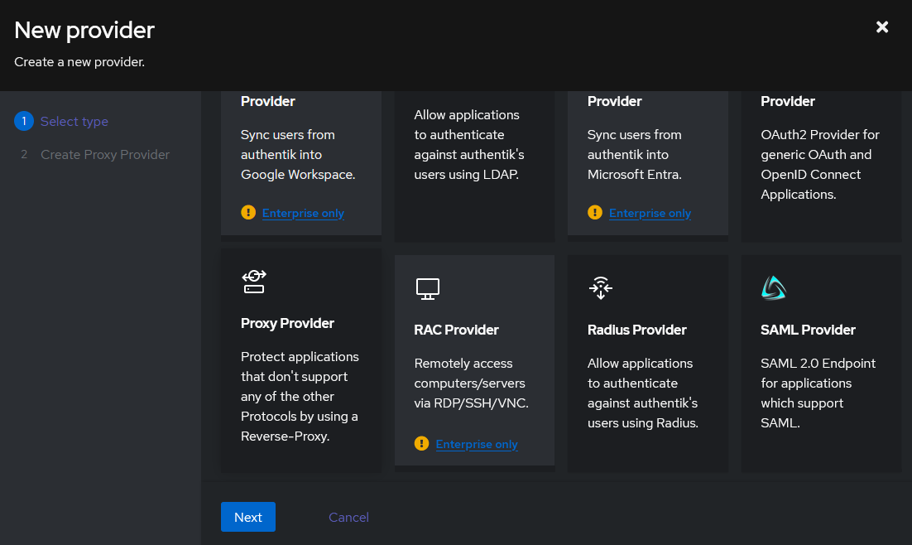
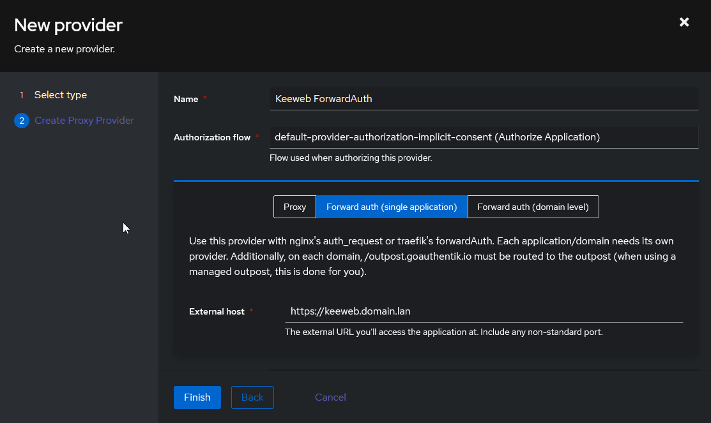
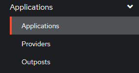
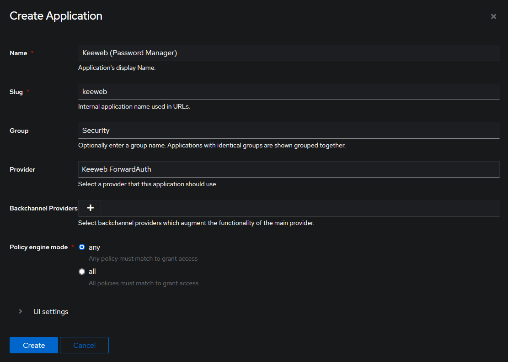
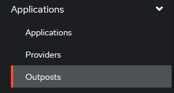
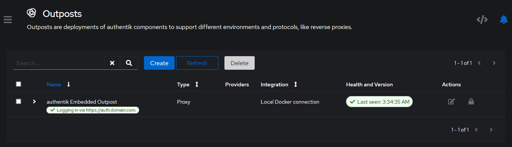
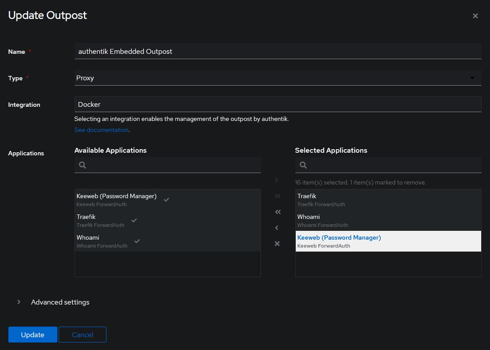

<div align="center">
<h6>Password Manager</h6>
<h1>KeeWeb Password Manager🔑</h1>

<br />

<p>
KeeWeb is a browser and desktop password manager which is capable of opening up existing KeePass database `kdbx` files, or creating new vaults to store your important credentials in.
</p>

<p align="center"></p>

<br />
<br />

</div>

<div align="center">

<!-- prettier-ignore-start -->
[![Version][github-version-img]][github-version-uri]
[![Tests][github-tests-img]][github-tests-uri]
[![Downloads][github-downloads-img]][github-downloads-uri]
[![Size][github-size-img]][github-size-img]
[![Last Commit][github-commit-img]][github-commit-img]
[![Contributors][contribs-all-img]](#contributors-)
<!-- prettier-ignore-end -->

</div>

<br />

---

<br />

- [About](#about)
  - [Quick Links](#quick-links)
- [Self-hosting](#self-hosting)
  - [Docker](#docker)
    - [Docker Run](#docker-run)
    - [Docker Compose](#docker-compose)
    - [Traefik Integration](#traefik-integration)
      - [Labels](#labels)
      - [Dynamic.yml](#dynamicyml)
      - [Static.yml](#staticyml)
        - [Providers](#providers)
        - [certificatesResolvers](#certificatesresolvers)
        - [entryPoints (Normal)](#entrypoints-normal)
        - [entryPoints (Cloudflare)](#entrypoints-cloudflare)
    - [Authentik Integration](#authentik-integration)
      - [Labels](#labels-1)
      - [Dynamic.yml](#dynamicyml-1)
  - [Env \& Volumes](#env--volumes)
    - [Env Variables](#env-variables)
    - [Volumes](#volumes)
  - [Dropbox Support](#dropbox-support)
- [Build From Source](#build-from-source)
  - [Platform: Windows](#platform-windows)
    - [Using Grunt](#using-grunt)
    - [Using NPM](#using-npm)
  - [Platform: Linux](#platform-linux)
    - [Using Grunt](#using-grunt-1)
    - [Using NPM](#using-npm-1)
  - [Platform: MacOS](#platform-macos)
    - [Using Grunt](#using-grunt-2)
    - [Using NPM](#using-npm-2)
- [Donations](#donations)
- [Contributors ✨](#contributors-)

<br />

---

<br />

## About

**KeeWeb** is a password manager which supports managing `kdbx` files created by other applications such as KeePass, KeePassXC, etc. You choose the platform you wish to run; as KeeWeb supports being installed and ran as either a Desktop application, or in your web-browser.

<br />

With support for Linux, Windows, and MacOS, we give you the tools to seamlessly manage your most important credentials across multiple applications and platforms.

<br />

Decide how you want to save your credential vault, KeeWeb supports saving your database as a local file, or you can store your password vault with some of the most popular cloud services such as Dropbox, Google Drive, and Microsoft OneDrive.

<br />

### Quick Links

Review some of our most important links below to learn more about KeeWeb and who we are:

<br />

| Topic | Links | Description |
| --- | --- | --- |
| **Apps** | [Web](https://app.keeweb.info/), [Desktop](https://github.com/keeweb/keeweb/releases/latest) | Try out our application |
| **Demos** | [Web](https://app.keeweb.info/), [Beta](https://beta.keeweb.info ) | Test our stable and beta releases of Keeweb |
| **Services** | [Favicon Grabber](https://services.keeweb.info/favicon) | Services integrated within Keeweb |
| **Branches** | [docker/alpine-base](https://github.com/keeweb/keeweb/tree/docker/alpine-base), [docker/keeweb](https://github.com/keeweb/keeweb/tree/docker/keeweb) | Important branches related to our project |
| **Timeline** | [Release Notes](release-notes.md), [TODO](https://github.com/keeweb/keeweb/wiki/TODO) | See what we're planning |
| **On one page** | [Features](https://keeweb.info/#features), [FAQ](https://github.com/keeweb/keeweb/wiki/FAQ) | Information about Keeweb development |
| **Website** | [keeweb.info](https://keeweb.info) | Visit our official website |
| **Social** | [kee_web](https://twitter.com/kee_web) | Check us out on our social media |
| **Donate** | [OpenCollective](https://opencollective.com/keeweb#support), [GitHub](https://github.com/sponsors/antelle) | Help keep us going |


<br />

---

<br />

## Self-hosting

Want to self-host your copy of KeeWeb? Everything you need to host this app on your server is provided within the package. KeeWeb itself is a single HTML file combined with a service worker (optionally; for offline access).

You can download the latest distribution files from **[gh-pages](https://github.com/keeweb/keeweb/archive/gh-pages.zip)** branch.

<br />

### Docker

If you wish to host Keeweb within a Docker container, we provide pre-built images that you can pull into your environment. This section explains how to run Keeweb using `docker run`, or by setting up a `docker-compose.yml` file.

<br />

> [!NOTE]
> For a full set of Docker instructions, visit our **[docker/keeweb readme](https://github.com/keeweb/keeweb/tree/docker/keeweb)**

<br />

#### Docker Run
If you wish to use `docker run`; use the following command:

```shell
docker run -d --restart=unless-stopped -p 443:443 --name keeweb -v ${PWD}/keeweb:/config ghcr.io/keeweb/keeweb:latest
```

<br />

#### Docker Compose
For users wishing to use `docker compose`, create a new `docker-compose.yml` with the following:

```yml
services:
    keeweb:
        container_name: keeweb
        image: ghcr.io/keeweb/keeweb:latest       # Github image
      # image: keeweb/keeweb:latest               # Dockerhub image
        restart: unless-stopped
        volumes:
            - ./keeweb:/config
        environment:
            - PUID=1000
            - PGID=1000
            - TZ=Etc/UTC
```

<br />

<br />

#### Traefik Integration
You can put this container behind Traefik if you want to use a reverse proxy and let Traefik handle the SSL certificate management.

<br />

> [!NOTE]
> These steps are **optional**. 
> 
> If you do not use Traefik, you can skip this section of steps. This is only for users who wish to put this container behind Traefik.
>
> If you do not wish to use Traefik, remember that if you make your Keeweb container public facing, you will need to utilize a service such as **[certbot/lets encrypt](https://phoenixnap.com/kb/letsencrypt-docker)** to generate SSL certificates.

<br />

Our first step is to tell Traefik about our Keeweb container. We highly recommend you utilize a Traefik **[dynamic file](#dynamicyml)**, instead of **[labels](#labels)**. Using a dynamic file allows for automatic refreshing without the need to restart Traefik when a change is made.

If you decide to use **[labels](#labels)** instead of a **[dynamic file](#dynamicyml)**, any changes you want to make to your labels will require a restart of Traefik.

<br />

We will be setting up the following:

- A `middleware` to re-direct http to https
- A `route` to access Keeweb via http (optional)
- A `route` to access Keeweb via https (secure)
- A `service` to tell Traefik how to access your Keeweb container
- A `resolver` so that Traefik can generate and apply a wildcard SSL certificate

<br />

##### Labels

To add Keeweb to Traefik, you will need to open your `docker-compose.yml` and apply the following labels to your Keeweb container. Ensure you change `domain.lan` to your actual domain name.

```yml
services:
    keeweb:
        container_name: keeweb
        image: ghcr.io/keeweb/keeweb:latest       # Github image
      # image: keeweb/keeweb:latest               # Dockerhub image
        restart: unless-stopped
        volumes:
            - ./keeweb:/config
        environment:
            - PUID=1000
            - PGID=1000
            - TZ=Etc/UTC
        labels:

          #   General
          - traefik.enable=true

          #   Router > http
          - traefik.http.routers.keeweb-http.rule=Host(`keeweb.localhost`) || Host(`keeweb.domain.lan`)
          - traefik.http.routers.keeweb-http.service=keeweb
          - traefik.http.routers.keeweb-http.entrypoints=http
          - traefik.http.routers.keeweb-http.middlewares=https-redirect@file

          #   Router > https
          - traefik.http.routers.keeweb-https.rule=Host(`keeweb.localhost`) || Host(`keeweb.domain.lan`)
          - traefik.http.routers.keeweb-https.service=keeweb
          - traefik.http.routers.keeweb-https.entrypoints=https
          - traefik.http.routers.keeweb-https.tls=true
          - traefik.http.routers.keeweb-https.tls.certresolver=cloudflare
          - traefik.http.routers.keeweb-https.tls.domains[0].main=domain.lan
          - traefik.http.routers.keeweb-https.tls.domains[0].sans=*.domain.lan

          #   Load Balancer
          - traefik.http.services.keeweb.loadbalancer.server.port=443
          - traefik.http.services.keeweb.loadbalancer.server.scheme=https
```

<br />

After you've added the labels above, skip the [dynamic.yml](#dynamicyml) section and go straight to the **[static.yml](#staticyml)** section.

<br />
<br />

##### Dynamic.yml

If you decide to not use **[labels](#labels)** and want to use a dynamic file, you will first need to create your dynamic file. the Traefik dynamic file is usually named `dynamic.yml`. We need to add a new `middleware`, `router`, and `service` to our Traefik dynamic file so that it knows about our new Keeweb container and where it is.

```yml
http:
    middlewares:
        https-redirect:
            redirectScheme:
                scheme: "https"
                permanent: true

    routers:
        keeweb-http:
            service: keeweb
            rule: Host(`keeweb.localhost`) || Host(`keeweb.domain.lan`)
            entryPoints:
                - http
            middlewares:
                - https-redirect@file

        keeweb-https:
            service: keeweb
            rule: Host(`keeweb.localhost`) || Host(`keeweb.domain.lan`)
            entryPoints:
                - https
            tls:
                certResolver: cloudflare
                domains:
                    - main: "domain.lan"
                      sans:
                          - "*.domain.lan"

    services:
        keeweb:
            loadBalancer:
                servers:
                    - url: "https://keeweb:443"
```

<br />

##### Static.yml
These entries will go in your Traefik `static.yml` file. Any changes made to this file requires that you restart Traefik afterward.

<br />

###### Providers

> [!NOTE]
> This step is only for users who opted to use the **[dynamic file](#dynamicyml)** method.
>
> Users who opted to use [labels](#labels) can skip to the section **[certificatesResolvers](#certificatesresolvers)**

<br />

Ensure you add the following new section to your `static.yml`:

<br />

```yml
providers:
    docker:
        endpoint: "unix:///var/run/docker.sock"
        exposedByDefault: false
        network: traefik
        watch: true
    file:
        filename: "/etc/traefik/dynamic.yml"
        watch: true
```

<br />

The code above is what enables the use of a **[dynamic file](#dynamicyml)** instead of labels. Change `/etc/traefik/dynamic.yml` if you are placing your dynamic file in a different location. This path is relative to inside the container, not your host machine mounted volume path. Traefik keeps most files in the `/etc/traefik/` folder.

<br />

After you add the above, open your Traefik's `docker-compose.yml` file and mount a new volume so that Traefik knows where your new dynamic file is:

```yml
    traefik:
        container_name: traefik
        image: traefik:latest
        restart: unless-stopped
        volumes:
            - /var/run/docker.sock:/var/run/docker.sock:ro
            - /etc/localtime:/etc/localtime:ro
            - ./config/traefik.yml:/etc/traefik/traefik.yml:ro
            - ./config/dynamic.yml:/etc/traefik/dynamic.yml:ro
```

<br />

You must ensure you add a new volume like shown above:

- `/config/dynamic.yml:/etc/traefik/dynamic.yml:ro`

<br />

On your host machine, make sure you place the `dynamic.yml` file in a sub-folder called **config**, which should be inside the same folder where your Traefik's `docker-compose.yml` file is. If you want to change this location, ensure you change the mounted volume path above.

<br />

After you have completed this, proceed to the section **[certificatesResolvers](#certificatesresolvers)**.

<br />

###### certificatesResolvers

> [!NOTE]
> This step is required no matter which option you picked above, both for **[dynamic file](#dynamicyml)** setups, as well as people using **[labels](#labels)**.

<br />

Open your Traefik `static.yml` file. We need to define the `certResolver` that we added above either in your dynamic file, or label. To define the `certResolver`, we will be adding a new section labeled `certificatesResolvers`. We are going to use Cloudflare in this example, you can use whatever from the list at:

- https://doc.traefik.io/traefik/https/acme/#providers

<br />

```yml
certificatesResolvers:
    cloudflare:
        acme:
            email: youremail@address.com
            storage: /cloudflare/acme.json
            keyType: EC256
            preferredChain: 'ISRG Root X1'
            dnsChallenge:
                provider: cloudflare
                delayBeforeCheck: 15
                resolvers:
                    - "1.1.1.1:53"
                    - "1.0.0.1:53"
                disablePropagationCheck: true
```

<br />

Once you pick the DNS / SSL provider you want to use from the code above, you need to see if that provider has any special environment variables that must be set. The **[Providers Page](https://doc.traefik.io/traefik/https/acme/#providers)** lists all providers and also what env variables need set for each one.

<br />

In our example, since we are using **Cloudflare** for `dnsChallenge` -> `provider`, we must set the following environment variables:

- `CF_API_EMAIL`
- `CF_API_KEY`

<br />

Create a `.env` environment file in the same folder where your Traefik `docker-compose.yml` file is located, and add the following:

```yml
CF_API_EMAIL=yourcloudflare@email.com
CF_API_KEY=Your-Cloudflare-API-Key
```

<br />

Save the `.env` file and exit. For these environment variables to be detected by Traefik, you must give your Traefik container a restart. Until you restart Traefik, it will not be able to generate your new SSL certificates. 

You can wait and restart in a moment after you finish editing the `static.yml` file, as there are more items to add below.

<br />

###### entryPoints (Normal)
Finally, inside the Traefik `static.yml`, we need to make sure we have our `entryPoints` configured. Add the following to the Traefik `static.yml` file only if you **DON'T** have entry points set yet:

```yml
entryPoints:
    http:
        address: :80
        http:
            redirections:
                entryPoint:
                    to: https
                    scheme: https

    https:
        address: :443
        http3: {}
        http:
            tls:
                options: default
                certResolver: cloudflare
                domains:
                    - main: domain.lan
                      sans:
                          - '*.domain.lan'
```

<br />

###### entryPoints (Cloudflare)
If your website is behind Cloudflare's proxy service, you need to modify your `entryPoints` above so that you can automatically allow Cloudflare's IP addresses through. This means your entry points will look a bit different.

<br />

In the example below, we will add `forwardedHeaders` -> `trustedIPs` and add all of Cloudflare's IPs to the list which are available here:
- https://cloudflare.com/ips/

```yml
    http:
        address: :80
        forwardedHeaders:
            trustedIPs: &trustedIps
                - 103.21.244.0/22
                - 103.22.200.0/22
                - 103.31.4.0/22
                - 104.16.0.0/13
                - 104.24.0.0/14
                - 108.162.192.0/18
                - 131.0.72.0/22
                - 141.101.64.0/18
                - 162.158.0.0/15
                - 172.64.0.0/13
                - 173.245.48.0/20
                - 188.114.96.0/20
                - 190.93.240.0/20
                - 197.234.240.0/22
                - 198.41.128.0/17
                - 2400:cb00::/32
                - 2606:4700::/32
                - 2803:f800::/32
                - 2405:b500::/32
                - 2405:8100::/32
                - 2a06:98c0::/29
                - 2c0f:f248::/32
        http:
            redirections:
                entryPoint:
                    to: https
                    scheme: https

    https:
        address: :443
        http3: {}
        forwardedHeaders:
            trustedIPs: *trustedIps
        http:
            tls:
                options: default
                certResolver: cloudflare
                domains:
                    - main: domain.lan
                      sans:
                          - '*.domain.lan'
```

<br />

Save the files and then give Traefik and your Keeweb containers a restart.

<br />

<br />

#### Authentik Integration

This section will not explain how to install and set up [Authentik](https://goauthentik.io/). We are only going to cover adding Keeweb integration to Authentik.

<br />

Sign into the Authentik admin panel, go to the left-side navigation, select **Applications** -> **Providers**. Then at the top of the new page, click **Create**.

<br />

<p align="center"></p>

<p align="center"></p>

<br />

For the **provider**, select `Proxy Provider`.

<br />

<p align="center"></p>

<br />

Add the following provider values:
- **Name**: `Keeweb ForwardAuth`
- **Authentication Flow**: `default-source-authentication (Welcome to authentik!)`
- **Authorization Flow**: `default-provider-authorization-implicit-consent (Authorize Application)`

<br />

Select **Forward Auth (single application)**:
- **External Host**: `https://keeweb.domain.lan`

<br />

<p align="center"></p>

<br />

Once finished, click **Create**. Then on the left-side menu, select **Applications** -> **Applications**. Then at the top of the new page, click **Create**.

<br />

<p align="center"></p>

<p align="center"></p>

<br />

Add the following parameters:
- **Name**: `Keeweb (Password Manager)`
- **Slug**: `keeweb`
- **Group**: `Security`
- **Provider**: `Keeweb ForwardAuth`
- **Backchannel Providers**: `None`
- **Policy Engine Mode**: `any`

<br />

<p align="center"></p>

<br />

Save, and then on the left-side menu, select **Applications** -> **Outposts**:

<br />

<p align="center"></p>

<br />

Find your **Outpost** and edit it.

<p align="center"></p>

<br />

Move `Keeweb (Password Manager)` to the right side **Selected Applications** box.

<br />

<p align="center"></p>

<br />

If you followed our [Traefik](#traefik-integration) guide above, you were shown how to add your Keeweb container to Traefik using either the **[dynamic file](#dynamicyml)** or **[labels](#labels)**. Depending on which option you picked, follow that section's guide below.

- For **label** users, go to the section [Labels](#labels-1) below.
- For **dynamic file** users, go to the section [Dynamic File](#dynamicyml-1) below.

<br />

##### Labels

Open your Keeweb's `docker-compose.yml` and modify your labels to include Authentik as a **middleware** by adding `authentik@file` to the label `traefik.http.routers.keeweb-https.middlewares`. You should have something similar to the example below:

```yml
services:
    keeweb:
        container_name: keeweb
        image: ghcr.io/keeweb/keeweb:latest       # Github image
      # image: keeweb/keeweb:latest               # Dockerhub image
        restart: unless-stopped
        volumes:
            - ./keeweb:/config
        environment:
            - PUID=1000
            - PGID=1000
            - TZ=Etc/UTC
        labels:

          #   General
          - traefik.enable=true

          #   Router > http
          - traefik.http.routers.keeweb-http.rule=Host(`keeweb.localhost`) || Host(`keeweb.domain.lan`)
          - traefik.http.routers.keeweb-http.service=keeweb
          - traefik.http.routers.keeweb-http.entrypoints=http
          - traefik.http.routers.keeweb-http.middlewares=https-redirect@file

          #   Router > https
          - traefik.http.routers.keeweb-https.rule=Host(`keeweb.localhost`) || Host(`keeweb.domain.lan`)
          - traefik.http.routers.keeweb-https.service=keeweb
          - traefik.http.routers.keeweb-https.entrypoints=https
          - traefik.http.routers.keeweb-https.middlewares=authentik@file
          - traefik.http.routers.keeweb-https.tls=true
          - traefik.http.routers.keeweb-https.tls.certresolver=cloudflare
          - traefik.http.routers.keeweb-https.tls.domains[0].main=domain.lan
          - traefik.http.routers.keeweb-https.tls.domains[0].sans=*.domain.lan

          #   Load Balancer
          - traefik.http.services.keeweb.loadbalancer.server.port=443
          - traefik.http.services.keeweb.loadbalancer.server.scheme=https
```

<br />

##### Dynamic.yml

If you opted to use the [dynamic file](#dynamicyml), open your Traefik's `dynamic.yml` file and apply the `authentik@file` middleware to look something like the following:

<br />

```yml
        keeweb-https:
            service: keeweb
            rule: Host(`keeweb.localhost`) || Host(`keeweb.domain.lan`)
            entryPoints:
                - https
            middlewares:
                - authentik@file
            tls:
                certResolver: cloudflare
                domains:
                    - main: "domain.lan"
                      sans:
                          - "*.domain.lan"
```

<br />

After you've done everything above, give your **Traefik** and **Authentik** containers a restart. Once they come back up; you should be able to access `keeweb.domain.lan` and be prompted now to authenticate with Authentik. Once you authenticate, you should be re-directed to your Keeweb home screen which asks you to load a vault file.

<br />

---

<br />

### Env & Volumes
This section outlines that environment variables can be specified, and which volumes you can mount when the container is started.

<br />

#### Env Variables
The following env variables can be modified before spinning up this container:

<br />

| Env Var | Default | Description |
| --- | --- | --- |
| `PUID`        | 1000      | <sub>User ID running the container</sub> |
| `PGID`        | 1000      | <sub>Group ID running the container</sub> |
| `TZ`          | Etc/UTC   | <sub>Timezone</sub> |
| `PORT_HTTP`   | 80        | <sub>Defines the HTTP port to run on</sub> |
| `PORT_HTTPS`  | 443       | <sub>Defines the HTTPS port to run on</sub> |

<br />

#### Volumes
The following volumes can be mounted with this container:

<br />

| Volume | Description |
| ---- | ---- |
| `./keeweb:/config` | <sub>Path which stores Keeweb, nginx configs, and optional SSL certificate/keys</sub> |

<br />

By mounting the volume above, you should now have access to the following folders:
<br />

| Folder | Description |
| ---- | ---- |
| `📁 keys`   | <sub>Responsible for storing your ssl certificate `cert.crt` + key `cert.key`</sub> |
| `📁 log`    | <sub>All nginx / container logs</sub> |
| `📁 nginx`  | <sub>Contains `nginx.conf`, `resolver.conf`, `ssl.conf`, `site-confs`</sub> |
| `📁 www`    | <sub>Folder which stores the Keeweb files, images, and plugins</sub> |

<br />

### Dropbox Support

To configure Dropbox support on your self-hosted setup [view our Wiki page](https://github.com/keeweb/keeweb/wiki/Dropbox-and-GDrive).

<br />

---

<br />

## Build From Source

The easiest way to clone all KeeWeb repos is:

```bash
curl https://raw.githubusercontent.com/keeweb/keeweb/develop/dev-env.sh | bash -
```

<br />

KeeWeb can be built utilizing the **grunt commandline**. Each platform has multiple commands you can use; pick one:

<br />

### Platform: Windows

You may build KeeWeb for `Windows` by executing ONE of the following two commands provided:

<br />

#### Using Grunt

```shell
grunt dev-desktop-win32 --skip-sign
```

<br />

#### Using NPM

```shell
npm run dev-desktop-windows
```

<br />

### Platform: Linux

You may build KeeWeb for `Linux` by executing ONE of the following two commands provided:

<br />

#### Using Grunt

```shell
grunt dev-desktop-linux --skip-sign
```

<br />

#### Using NPM

```shell
npm run dev-desktop-linux
```

<br />
<br />

### Platform: MacOS

You may build KeeWeb for `MacOS` by executing ONE of the following two commands provided:

#### Using Grunt

```shell
grunt dev-desktop-darwin --skip-sign
```

#### Using NPM

```shell
npm run dev-desktop-macos
```

<br />

Once the build is complete, all (html files will be in `dist/` folder. To build KeeWeb, utilize the following commands below.

<br />

To run the desktop (electron) app without building an installer, build the app with `grunt` and then launch KeeWeb with one of the following commands:

<br />

```bash
npm run dev
npm run electron
```

<br />

To debug your build:

1. run `npm run dev`
2. open `http://localhost:8085`

<br />

Once built, the output files will be generated in `tmp`:

<br />

---

<br />

## Donations

KeeWeb is not free to develop. It takes time, requires paid code signing certificates and domains.  
You can help the project or say "thank you" with this button:  
[](https://opencollective.com/keeweb#support)

<br />

You can also sponsor the developer directly [on GitHub](https://github.com/sponsors/antelle).

<br />

Please note: donation does not imply any type of service contract.

<br />

---

<br />

## Contributors ✨
We are always looking for contributors. If you feel that you can provide something useful to Gistr, then we'd love to review your suggestion. Before submitting your contribution, please review the following resources:

- [Pull Request Procedure](.github/PULL_REQUEST_TEMPLATE.md)
- [Contributor Policy](CONTRIBUTING.md)

<br />

Want to help but can't write code?
- Review [active questions by our community](https://github.com/keeweb/keeweb/labels/help%20wanted) and answer the ones you know.

<br />


Want to help but can't write code?

- Review [active questions by our community](https://github.com/keeweb/keeweb/labels/help%20wanted) and answer the ones you know.
- Help [translating KeeWeb](https://keeweb.oneskyapp.com)

<br />

<div align="center">

<!-- ALL-CONTRIBUTORS-BADGE:START - Do not remove or modify this section -->
[![Contributors][contribs-all-img]](#contributors-)
<!-- ALL-CONTRIBUTORS-BADGE:END -->

<!-- ALL-CONTRIBUTORS-LIST:START - Do not remove or modify this section -->
<!-- prettier-ignore-start -->
<!-- markdownlint-disable -->
<table>
  <tbody>
    <tr>
      <td align="center" valign="top" width="14.28%"><a href="https://gitlab.com/antelle"><br /><sub><b>Antelle</b></sub></a><br /><a href="https://github.com/KeeWeb/KeeWeb/commits?author=antelle" title="Code">💻</a> <a href="#projectManagement-antelle" title="Project Management">📆</a> <a href="#fundingFinding-antelle" title="Funding Finding">🔍</a></td>
      <td align="center" valign="top" width="14.28%"><a href="https://gitlab.com/Aetherinox"><br /><sub><b>Aetherinox</b></sub></a><br /><a href="https://github.com/KeeWeb/KeeWeb/commits?author=Aetherinox" title="Code">💻</a> <a href="#projectManagement-Aetherinox" title="Project Management">📆</a> <a href="#fundingFinding-Aetherinox" title="Funding Finding">🔍</a></td>
      <td align="center" valign="top" width="14.28%"><a href="https://gitlab.com/HarlemSquirrel"><br /><sub><b>HarlemSquirrel</b></sub></a><br /><a href="https://github.com/KeeWeb/KeeWeb/commits?author=HarlemSquirrel" title="Code">💻</a> <a href="#projectManagement-HarlemSquirrel" title="Project Management">📆</a></td>
    </tr>
  </tbody>
</table>

<!-- markdownlint-restore -->
<!-- prettier-ignore-end -->
<!-- ALL-CONTRIBUTORS-LIST:END -->

<br />
<br />

---

<br />

<!-- prettier-ignore-start -->
<!-- markdownlint-disable -->

<!-- BADGE > GENERAL -->
  [general-npmjs-uri]: https://npmjs.com
  [general-nodejs-uri]: https://nodejs.org
  [general-npmtrends-uri]: http://npmtrends.com/keeweb

<!-- BADGE > VERSION > GITHUB -->
  [github-version-img]: https://img.shields.io/github/v/tag/keeweb/keeweb?logo=GitHub&label=Version&color=ba5225
  [github-version-uri]: https://github.com/keeweb/keeweb/releases

<!-- BADGE > VERSION > NPMJS -->
  [npm-version-img]: https://img.shields.io/npm/v/keeweb?logo=npm&label=Version&color=ba5225
  [npm-version-uri]: https://npmjs.com/package/keeweb

<!-- BADGE > VERSION > PYPI -->
  [pypi-version-img]: https://img.shields.io/pypi/v/keeweb
  [pypi-version-uri]: https://pypi.org/project/keeweb/

<!-- BADGE > LICENSE > MIT -->
  [license-mit-img]: https://img.shields.io/badge/MIT-FFF?logo=creativecommons&logoColor=FFFFFF&label=License&color=9d29a0
  [license-mit-uri]: https://github.com/keeweb/keeweb/blob/main/LICENSE

<!-- BADGE > GITHUB > DOWNLOAD COUNT -->
  [github-downloads-img]: https://img.shields.io/github/downloads/keeweb/keeweb/total?logo=github&logoColor=FFFFFF&label=Downloads&color=376892
  [github-downloads-uri]: https://github.com/keeweb/keeweb/releases

<!-- BADGE > NPMJS > DOWNLOAD COUNT -->
  [npmjs-downloads-img]: https://img.shields.io/npm/dw/%40keeweb%2Fkeeweb?logo=npm&&label=Downloads&color=376892
  [npmjs-downloads-uri]: https://npmjs.com/package/keeweb

<!-- BADGE > GITHUB > DOWNLOAD SIZE -->
  [github-size-img]: https://img.shields.io/github/repo-size/keeweb/keeweb?logo=github&label=Size&color=59702a
  [github-size-uri]: https://github.com/keeweb/keeweb/releases

<!-- BADGE > NPMJS > DOWNLOAD SIZE -->
  [npmjs-size-img]: https://img.shields.io/npm/unpacked-size/keeweb/latest?logo=npm&label=Size&color=59702a
  [npmjs-size-uri]: https://npmjs.com/package/keeweb

<!-- BADGE > CODECOV > COVERAGE -->
  [codecov-coverage-img]: https://img.shields.io/codecov/c/github/keeweb/keeweb?token=MPAVASGIOG&logo=codecov&logoColor=FFFFFF&label=Coverage&color=354b9e
  [codecov-coverage-uri]: https://codecov.io/github/keeweb/keeweb

<!-- BADGE > ALL CONTRIBUTORS -->
  [contribs-all-img]: https://img.shields.io/github/all-contributors/keeweb/keeweb?logo=contributorcovenant&color=de1f6f&label=contributors
  [contribs-all-uri]: https://github.com/all-contributors/all-contributors

<!-- BADGE > GITHUB > BUILD > NPM -->
  [github-build-img]: https://img.shields.io/github/actions/workflow/status/keeweb/keeweb/release-build.yml?logo=github&logoColor=FFFFFF&label=Build&color=%23278b30
  [github-build-uri]: https://github.com/keeweb/keeweb/actions/workflows/release-build.yml

<!-- BADGE > GITHUB > BUILD > Pypi -->
  [github-build-pypi-img]: https://img.shields.io/github/actions/workflow/status/keeweb/keeweb/release-pypi.yml?logo=github&logoColor=FFFFFF&label=Build&color=%23278b30
  [github-build-pypi-uri]: https://github.com/keeweb/keeweb/actions/workflows/release-pypi.yml

<!-- BADGE > GITHUB > TESTS -->
  [github-tests-img]: https://img.shields.io/github/actions/workflow/status/keeweb/keeweb/build-tests.yml?logo=github&label=Tests&color=2c6488
  [github-tests-uri]: https://github.com/keeweb/keeweb/actions/workflows/build-tests.yml

<!-- BADGE > GITHUB > COMMIT -->
  [github-commit-img]: https://img.shields.io/github/last-commit/keeweb/keeweb?logo=conventionalcommits&logoColor=FFFFFF&label=Last%20Commit&color=313131
  [github-commit-uri]: https://github.com/keeweb/keeweb/commits/main/

<!-- prettier-ignore-end -->
<!-- markdownlint-restore -->
